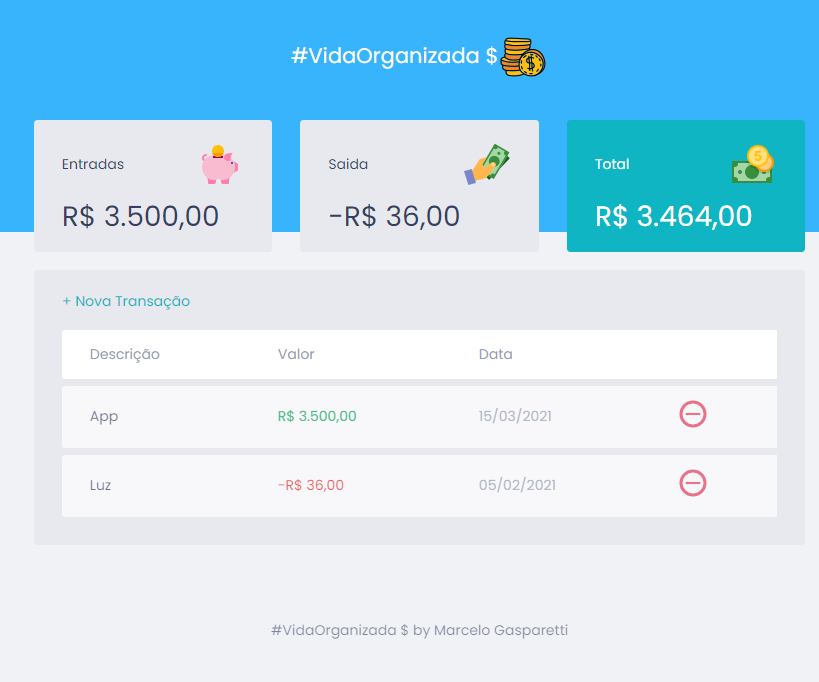
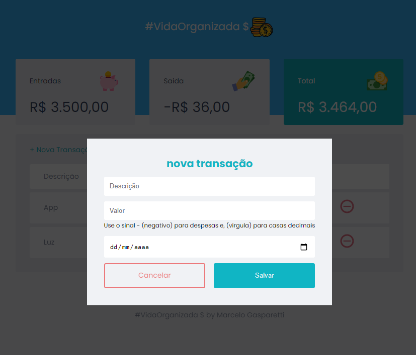

<h1 align="center">
# vidaorganizada

</h1>

## 📝 Sobre

Este Repo criado para o curso <b>Maratina Discover</b> da <b>Rocketseat</b>.
Durante as aulas aprendemos a construção de uma App Web. Durante as semanas temos alguns desafios para melhorar o designe e as funcionalidades. 

## Tecnologias
- HTML
- CSS
- JavaScript

<<>><<>><<>><<>><<>><<>><<>><<>><<>><<>><<>><<>><<>>

- Na Tela inicial teremos o cadastro de todas os nossos ganhos e gastos diarios. Automaticamente o app ira fazer o calculo de todas as suas dispesas e o valor que você terá disponivel em sua Carteira

- Clicando no link +Nova Transação, uma tela será aberta para que você possa fazer seus cadastros de Ganhos e Despesas. Após o cadastro é só clicar em salvar.

- Se quiser pode remover algum lançamento que fez clicando no botão 
